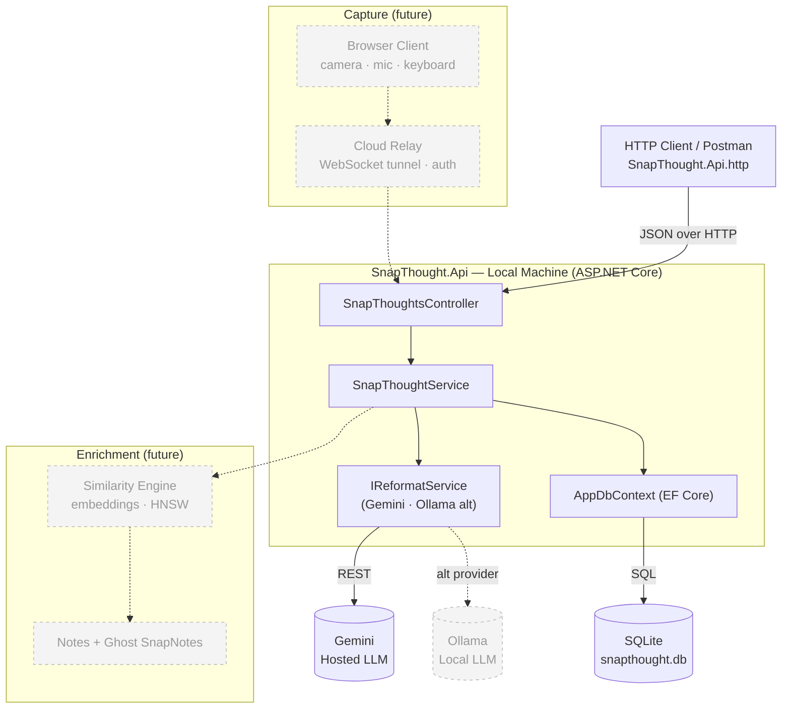
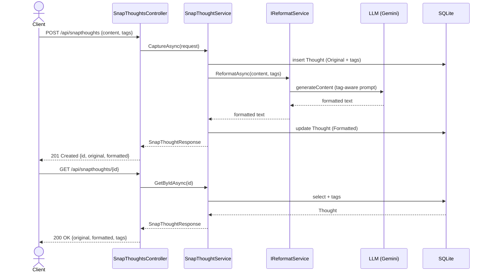

# SnapThought

A personal thought-capture system where raw thoughts (text, image, voice) are sent to a local machine via a secure cloud relay, reformatted by an LLM, and organized through a tag-driven similarity engine and lightweight notes system. Built with C# and ASP.NET Core.

> **Status — base version.** This repo currently implements the local API and the LLM
> reformatting integration end to end: **capture a thought → reformat it → store it → retrieve it.**
> The larger vision (cloud relay, browser client, similarity engine, notes) is shown dimmed in the
> diagrams below as planned work, not yet built.

## Architecture

The base version is an ASP.NET Core Web API that persists to SQLite and calls a hosted LLM
(Google Gemini by default) to reformat each captured thought, keeping both the raw and formatted
text. The reformatting provider is swappable behind `IReformatService` (a local **Ollama** provider
is included as an alternate). Solid nodes are built; **dashed/grey nodes are future work.**

### Component view



### End-to-end flow (capture → reformat → store → retrieve)



> If the LLM key is missing or the call fails, capture still succeeds — `formatted` falls back to
> the original text and a warning is logged, so the pipeline never hard-fails on the LLM.

## Tech stack

- **.NET 10** / ASP.NET Core Web API (controllers)
- **EF Core 10** + **SQLite** (single-machine, no DB server)
- **Google Gemini** REST API for reformatting (provider-agnostic via `IReformatService`; **Ollama** local provider included)
- OpenAPI (dev) for schema exploration

## API

| Method | Route                      | Purpose                                            |
| ------ | -------------------------- | -------------------------------------------------- |
| `POST` | `/api/snapthoughts`        | Capture a raw thought (+ optional tags), reformat, store |
| `GET`  | `/api/snapthoughts/{id}`   | Retrieve one stored thought                        |
| `GET`  | `/api/snapthoughts`        | List all stored thoughts (newest first)            |

## Getting Started

1. **Provide a Gemini API key** (free tier works). Get one from Google AI Studio, then store it via
   user-secrets (preferred) or an environment variable — never commit it:

   ```bash
   cd SnapThought.Api
   dotnet user-secrets set "Gemini:ApiKey" "<your-key>"
   # or, equivalently:  setx Gemini__ApiKey "<your-key>"   (new shell after)
   ```

2. **Run the API** (the SQLite database and schema are created automatically on startup):

   ```bash
   dotnet run
   ```

3. **Exercise the flow** using [SnapThought.Api.http](SnapThought.Api/SnapThought.Api.http) (VS / VS Code REST client) or Postman:
   `POST /api/snapthoughts` with a `content` string and optional `tags`, then `GET /api/snapthoughts/{id}`.

### Configuration

Set in `appsettings.json`, user-secrets, or environment variables:

| Key                       | Default                       | Notes                                      |
| ------------------------- | ----------------------------- | ------------------------------------------ |
| `Llm:Provider`            | `Gemini`                      | Set to `Ollama` to use the local provider  |
| `Gemini:Model`            | `gemini-3.0-flash`            | Hosted model id (from appsettings.json)    |
| `Gemini:ApiKey`           | _(none)_                      | **Secret** — env `Gemini__ApiKey` / user-secrets |
| `Ollama:BaseUrl`          | `http://localhost:11434`      | Used only when `Llm:Provider=Ollama`       |
| `Ollama:Model`            | `llama3.2`                    | Local model id                             |
| `ConnectionStrings:Default` | `Data Source=snapthought.db` | SQLite file path                          |

## Project layout

```
SnapThought.Api/
  Controllers/SnapThoughtsController.cs   # REST surface
  Services/                               # IReformatService (+ Gemini, Ollama), SnapThoughtService
  Models/                                 # Thought, Tag entities + request/response DTOs
  Data/AppDbContext.cs                    # EF Core context
  Migrations/                             # EF Core schema
```
